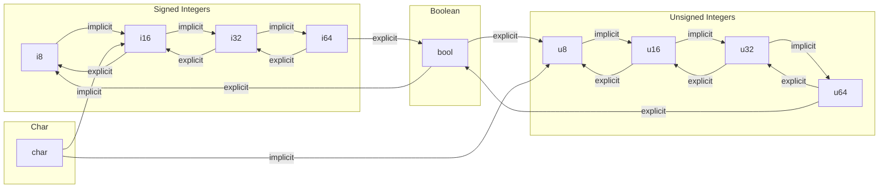

# Conversion

The conversion system manages how types can be transformed into one another. It supports two levels of conversion:
implicit and explicit.

## Implicit Conversion

Implicit conversion is a type conversion performed automatically by the compiler without requiring an explicit
cast or conversion operator. It is used to convert a value from one type to another without any loss of information or
precision (e.g., promoting an `i8` to `i32`).

## Explicit Conversion

Explicit conversion, also known as casting, is a type conversion that requires an explicit cast or conversion operator
to be used. It is used to convert a value from one type to another when there might be a loss of information or
precision (e.g., downcasting `i64` to `i8`), or when the conversion is semantically significant (e.g., `bool` to `i8`).

## BFS Casting

To simplify the definition of conversion rules, we use a Breadth-First Search (BFS) algorithm to find the shortest path
from a source type to a target type. This allows us to define only 1:1 direct rules while the system automatically
discovers multistep conversions.

For example, if we define the following rules:

- `i8` -> `i16` (Implicit)
- `i16` -> `i32` (Implicit)
- `i32` -> `i64` (Implicit)

The system automatically resolves a conversion from `i8` to `i64` by following the path `i8 -> i16 -> i32 -> i64`.

### Identity Conversion

If the source type and target type are identical, the system returns an empty path, indicating no conversion steps are
needed.

## Conversion Rules Visualization

The following diagram illustrates the current direct conversion rules:

## Performance and Design

While the BFS approach is flexible, it is recommended to directly declare frequent conversion rules to improve compiler
performance. Additionally, care must be taken as long conversion paths might lead to unexpected precision loss if not
designed carefully.

Also, it’ll make sense in the future to add a cost table and use dijkstra algorithm to reduce unnecessary high-cost
casts.